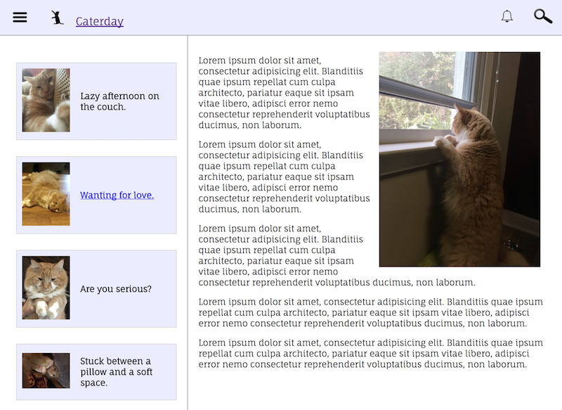

# Blog-Website
DigitalCrafts Project: blog page modeled after Medium.com website

<b>Overall Concept</b>

The design of this website focused on different aspects of flexbox. We used the blog site, Medium.com, as a general layout and deisnged our own website from there.

The ball of orange fluff is my cat, Oliver. He's a typical cat. Lays around, knocks drinks over (and anything else he can find), but I love him all the same! In this design, I created a few linked html pages. One is "The day the Windows Were Open" and the other is "Waiting for love". Adding these pages was to expand the same style, but create another aspect of a website.

The navigation bar "Caturday" links back to the main page. Within the main page, the featured article in the jumbotron leads to a simple website that I previously created and deployed on the AWS server.

Though this website I explored a few different aspects in addition to flexbox. One was adding the :hover function. Another was creating and adding a favicon (icon on the browser's tab).

<b>Overall:</b>
Great project to continue working on flexbox layout and expand website development. Experimenting with hover aspects was quite entertaining. In turn, I can't wait to see everything that JavaScrip can implement. 

<b>Future Changes:</b>

My goal is to peirodically update this site as my skill expland. I feel it would be a great way to look back at code and understand past projects, making sure commit are well articulated and notes left within HTML and CSS files are informative.

<h3>Main page of Caturday showing drop down hamburger menu and link to another website blog</h3>
 

<h3>Outline of blog with main post and article on left with other blog posts on left hand side</h3>
 

<h3>Same blog post as above except mobile version. Condences side colum to titles only and rearranges to top of the screen. Shows how full article and photo have been made responsive for mobile versions.</h3>
